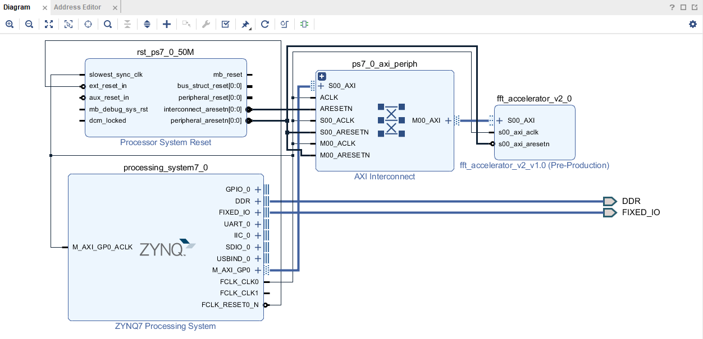
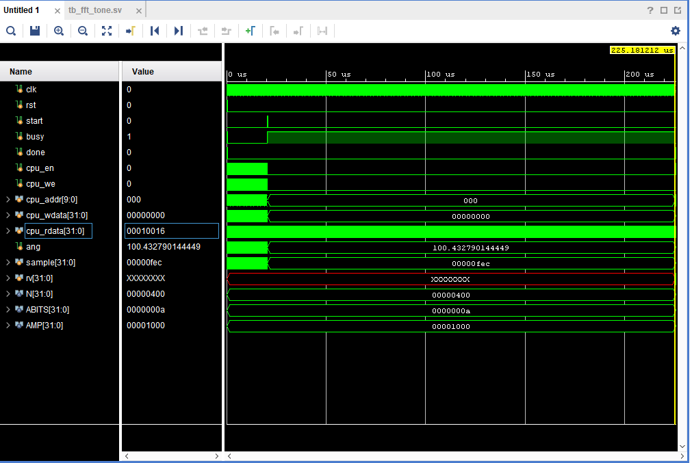
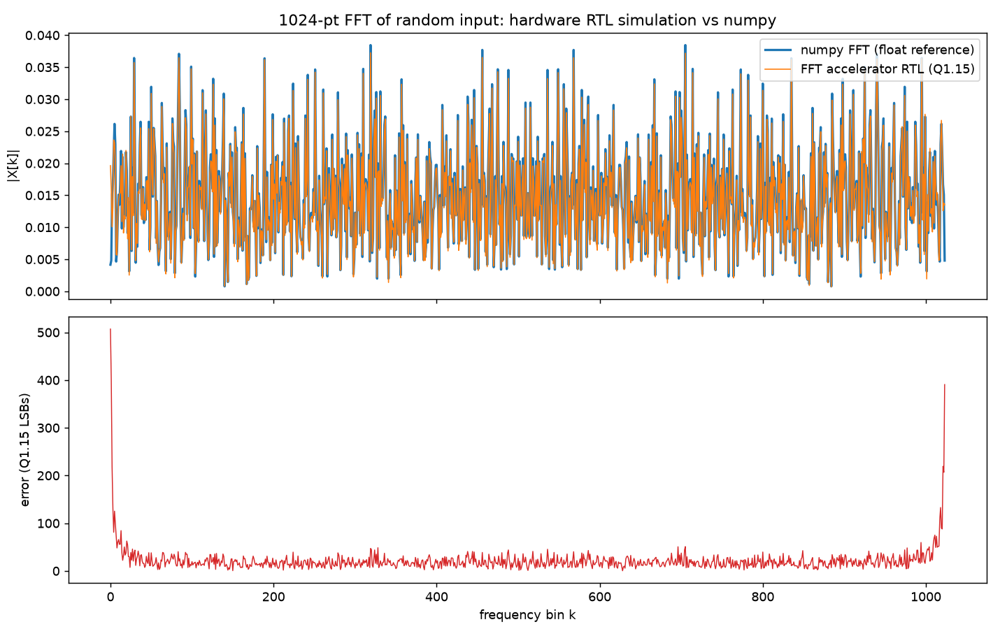
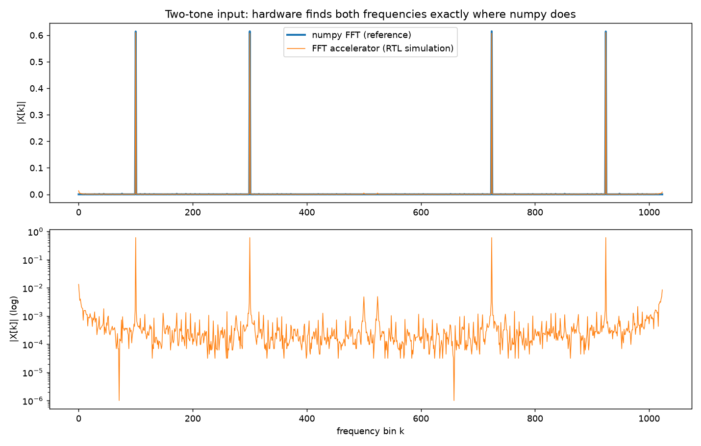
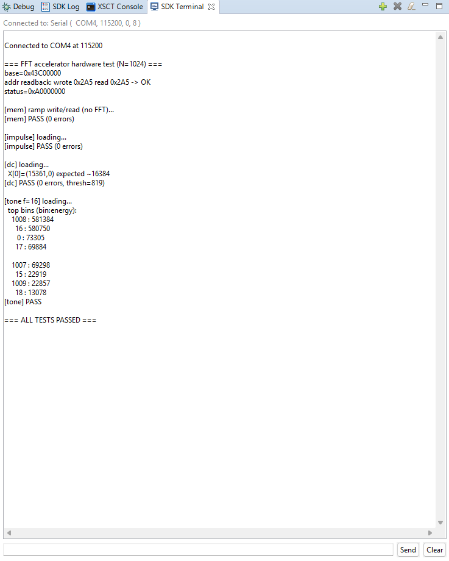
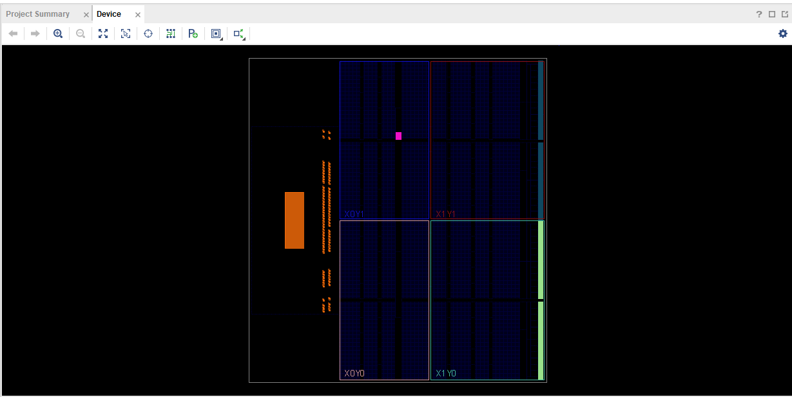
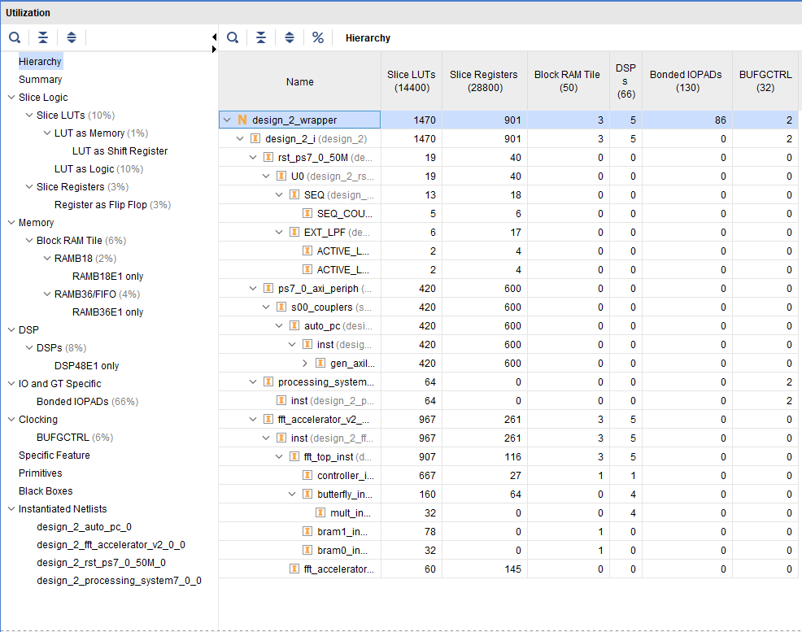

# FFT Hardware Accelerator

> A **1024-point fixed-point Radix-2 Cooley–Tukey Fast Fourier Transform (FFT) accelerator** implemented in **SystemVerilog** for the **Xilinx MiniZed (Zynq-7000 SoC)**. The accelerator is integrated as a custom **AXI4-Lite IP**, controlled through **Vitis**, and successfully validated on FPGA hardware.

---

# Project Overview

The Fast Fourier Transform (FFT) is one of the most widely used algorithms in digital signal processing, enabling efficient conversion of signals from the time domain into their frequency-domain representation. Because FFT computation is computationally intensive, software implementations can become a performance bottleneck in applications that require real-time processing.

This project accelerates FFT computation by implementing a **1024-point fixed-point Radix-2 Cooley–Tukey FFT** entirely in FPGA hardware using **SystemVerilog**. The accelerator is packaged as a custom **AXI4-Lite IP core** and integrated into a **Xilinx Zynq-7000 (MiniZed)** platform, where it communicates with the ARM Cortex-A9 Processing System through the AXI bus.

Software developed in **Vitis** loads input samples into the accelerator, initiates the FFT computation, and retrieves the frequency-domain results after execution. The complete design was functionally verified through RTL simulation, compared against a NumPy reference implementation, synthesized and implemented in Vivado, and successfully validated on physical FPGA hardware.

This repository demonstrates the complete FPGA accelerator development workflow, including RTL design, simulation, custom IP development, AXI integration, hardware implementation, embedded software development, and end-to-end hardware verification.

---

# Features

-  1024-Point Radix-2 Cooley–Tukey FFT
-  Q1.15 Fixed-Point Arithmetic
-  SystemVerilog RTL Implementation
-  Custom AXI4-Lite Hardware Accelerator
-  BRAM-Based Memory Architecture
-  Twiddle Factor ROM with Precomputed Coefficients
-  Vivado IP Packaging and Integration
-  ARM Cortex-A9 Software Interface (Vitis)
-  RTL Simulation and Verification
-  NumPy Reference Comparison
-  End-to-End FPGA Hardware Validation on MiniZed

---
# Project Demonstration

The FFT accelerator was successfully synthesized, implemented, and validated on the **Xilinx MiniZed (Zynq-7000)** platform. The complete design was verified through RTL simulation, compared against a NumPy software reference, and executed on physical FPGA hardware using embedded software developed in **Vitis**.

The following sections highlight the complete implementation and verification flow.

---

## Vivado Block Design
<p align="center">

</p>

<p align="center">
<i>Figure 1. Vivado block design integrating the custom FFT accelerator with the ARM Cortex-A9 Processing System.</i>
</p>

The block design illustrates the integration of the custom FFT accelerator into the Zynq-7000 processing system using the AXI4-Lite protocol. The ARM Cortex-A9 processor communicates with the accelerator through the AXI interconnect, allowing software developed in Vitis to configure the hardware, transfer input samples, initiate FFT execution, and retrieve the resulting frequency-domain data. A Processor System Reset module is used to synchronize reset signals across the programmable logic, while the AXI interconnect routes transactions between the processing system and the custom FFT IP. This architecture enables seamless hardware/software co-design while exposing the accelerator as a standard memory-mapped peripheral.

---

## RTL Simulation

<p align="center">

</p>

<p align="center">
<i>Figure 2. RTL simulation waveform demonstrating successful FFT execution.</i>
</p>
The RTL simulation verifies the functional behavior of the FFT accelerator prior to FPGA implementation. The waveform captures the interaction between the control logic and memory interface as the accelerator progresses through an FFT computation. The simulation confirms correct sequencing of the control signals (`start`, `busy`, and `done`) as well as proper communication over the CPU interface. It also verifies that data is correctly transferred between the processing logic and on-chip memory throughout execution.

---

## Verification Against NumPy

To verify the numerical accuracy of the hardware implementation, the FFT accelerator was compared against a software reference generated using **NumPy's FFT library**. The hardware outputs were collected from RTL simulation and evaluated against the floating-point software implementation using identical input vectors.

Because the accelerator uses **Q1.15 fixed-point arithmetic**, small numerical differences are expected due to quantization and finite precision. Despite these limitations, the accelerator closely matches the NumPy reference while maintaining significantly lower hardware complexity than a floating-point implementation.

### Random Input Verification

The first verification uses a randomly generated input signal. The upper plot compares the magnitude spectrum produced by the RTL simulation with the NumPy reference, while the lower plot illustrates the absolute error between the two implementations measured in Q1.15 least significant bits (LSBs).

<p align="center">

</p>

<p align="center">
<i>Figure 3. Comparison of the RTL FFT output against the NumPy reference for a random input signal. The lower plot shows the absolute fixed-point error across all 1024 frequency bins.</i>
</p>

A randomly generated input vector was used to evaluate the overall numerical accuracy of the hardware implementation. The upper plot compares the FFT magnitude produced by the RTL simulation against NumPy's floating-point reference implementation. The two curves closely overlap across all 1024 frequency bins, demonstrating that the hardware implementation accurately reproduces the expected spectral response. The lower plot illustrates the absolute fixed-point error measured in Q1.15 least significant bits (LSBs). As expected, the observed error is small and primarily results from finite-precision arithmetic rather than algorithmic inaccuracies.

---

### Two-Tone Signal Verification

A second verification was performed using a two-tone input signal consisting of two sinusoidal frequencies. This test validates that the accelerator correctly identifies discrete frequency components and places spectral peaks at the expected frequency bins.

<p align="center">

</p>

<p align="center">
<i>Figure 4. Comparison between the FFT accelerator and the NumPy reference for a two-tone input signal.</i>
</p>

To verify frequency localization, a two-tone sinusoidal input was applied at the exact same frequency bins as the NumPy reference, confirming that the butterfly operations, twiddle factor lookups, addressing logic, and FFT sequencing are functioning correctly. The lower logarithmic plot highlights the small numerical differences introduced by fixed-point arithmetic while demonstrating excellent agreement between the hardware and software implementations. To verify frequency localization, a two-tone sinusoidal input was applied to both the RTL implementation and the NumPy reference model. The accelerator correctly identifies both frequency components, producing spectral peaks at the same frequency bins as the floating-point implementation. The logarithmic error plot demonstrates that differences between the hardware and software implementations remain extremely small across the spectrum, validating the correctness of the butterfly computations, twiddle factor lookups, and fixed-point arithmetic.

---

## Embedded Software (Vitis)

The ARM Cortex-A9 processor communicates with the accelerator through the AXI4-Lite interface. Software running in **Vitis** loads the input samples into the FFT accelerator, initiates computation, waits for completion, and reads back the resulting frequency-domain data.

<p align="center">

</p>

<p align="center">
<i>Figure 5. Successful end-to-end hardware validation using Vitis.</i>
</p>
Following successful synthesis and implementation, the accelerator was validated on physical hardware using software developed in Vitis. The ARM Cortex-A9 processor writes input samples to the accelerator through the AXI interface, initiates FFT execution, and reads the resulting spectrum after completion. The hardware test suite verifies several functional aspects of the accelerator, including memory access, impulse response, DC response, and frequency localization using a sinusoidal test signal. All tests completed successfully, confirming correct end-to-end operation of the hardware/software system.


---

## FPGA Implementation

Following verification, the design was synthesized and implemented using **Vivado** for the Xilinx MiniZed platform.

### Device Placement

<p align="center">

</p>

<p align="center">
<i>Figure 6. FPGA device placement after implementation.</i>
</p>

After implementation, Vivado places the synthesized logic onto the programmable fabric of the Zynq-7000 FPGA. The placement view illustrates the physical distribution of the accelerator across the device resources. Because the FFT accelerator occupies only a small portion of the available programmable logic, significant FPGA resources remain available for future enhancements such as larger FFT sizes, additional processing pipelines, DMA engines, or streaming interfaces.

### Resource Utilization

<p align="center">

</p>

<p align="center">
<i>Figure 7. FPGA resource utilization reported by Vivado.</i>
</p>

The synthesized FFT accelerator occupies only a modest percentage of the available FPGA resources, demonstrating an efficient hardware implementation.

The design utilizes approximately:

- **10%** of available Slice LUTs
- **3%** of Slice Registers
- **6%** of Block RAM resources
- **8%** of available DSP slices

The relatively low resource utilization provides substantial headroom for future architectural improvements while maintaining efficient implementation on the MiniZed platform.

---

## Hardware Test Results

The completed design successfully passed all hardware validation tests executed on the MiniZed FPGA.

```text
=== FFT accelerator hardware test (N=1024) ===

[mem] PASS

[impulse] PASS

[dc] PASS

[tone] PASS

=== ALL TESTS PASSED ===
```

Collectively, these results demonstrate that the FFT accelerator operates correctly across both simulation and hardware environments. Agreement with the NumPy reference implementation, combined with successful execution on the MiniZed FPGA, verifies the correctness of the RTL design, AXI interface, memory subsystem, and embedded software driver. The completed project represents a full hardware/software co-design workflow, from algorithm implementation and RTL development through FPGA deployment and end-to-end hardware validation.

## Hardware Tests
1. Register Check
   - Writes value to ADDR before reading it back, confirming BRAM functionality
2. Memory Test
   - Writes a ramping value to each address using natural addresses
   - Reads back every address ensuring they match
3. Impulse Test
   - Loads single value A into x[0] in bit reversed order
   - Counts and prints mismatches with expected FFT
4. DC Test
   - Loads all values as A
   - Counts and prints errors up to 10
5. Tone Test
   - Generates input sample by sample using rotating phasor
   - Passes only if two largest energy bins are bin 16 and bin 1008
---

# Repository Structure

The repository is organized into separate directories for the RTL source code, verification environment, supporting scripts, generated coefficient data, and project documentation.

```text
FFT_Hardware_Accelerator/
│
├── src/                     # SystemVerilog RTL source files
│   ├── butterfly.sv
│   ├── complex_mult.sv
│   ├── fft_axi_wrapper.sv
│   ├── fft_bram.sv
│   ├── fft_controller.sv
│   ├── fft_top.sv
│   └── fft_twiddle_rom.sv
│
├── tb/                      # SystemVerilog testbenches
│   ├── tb_fftcont.sv
│   ├── tb_bram.sv
│   ├── tb_butterfly.sv
│   ├── tb_complex_mult.sv
│   ├── tb_fft_top.sv
│   └── tb_twiddle_rom.sv
│
├── scripts/                 # Python utility scripts
│   ├── full_FFT.py
│   ├── pythonCheck.py
│   └── twiddle_gen.py
│
├── data/                    # Precomputed twiddle factor lookup tables
│   ├── twiddle_real*.hex
│   └── twiddle_imag*.hex
│
├── images/                  # README figures and screenshots
│   ├── block_design.png
│   ├── waveform.png
│   ├── numpy_random.png
│   ├── numpy_tone.png
│   ├── placement.png
│   ├── fpga_placement.png
│   ├── utilization.png
│   └── vitis_output.png
│
├── SDK/                     #Verification of Hardware Description Language
|   ├── vitisMain.c
|
├── waveforms/               # Simulation waveform captures
│
├── LICENSE
└── README.md
```

### Directory Overview

| Directory | Description |
|-----------|-------------|
| **src/** | SystemVerilog RTL implementation of the FFT accelerator, including the butterfly processor, controller, memory system, twiddle ROM, and AXI interface. |
| **tb/** | Standalone SystemVerilog testbenches used to functionally verify each RTL module and the complete FFT accelerator. |
| **scripts/** | Python scripts used for FFT verification, twiddle factor generation, and comparison against the NumPy software reference. |
| **data/** | Precomputed Q1.15 twiddle-factor lookup tables used by the hardware Twiddle ROM. |
| **images/** | Figures, screenshots, and plots included throughout this README. |
| **waveforms/** | Simulation waveform captures generated during RTL verification. |

The modular organization separates the RTL implementation, verification environment, supporting utilities, and documentation, making the project easier to navigate, maintain, and extend.

---

# Acknowledgements

We would like to express our sincere gratitude to **Professor Peter A. Milder** for his guidance, mentorship, and support throughout the development of this project.

---

## Authors

**Faid Faisal**  
B.S. Computer Engineering  
Stony Brook University  

**Paddy Xiang Zheng**  
B.S. Computer Engineering  
Stony Brook University


